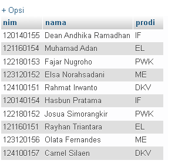

# Pertemuan5

Dean Andhika Ramadhan  
120140155  
Praktikum Pemrograman Web P-5  

> Membuat aplikasi web yang dapat menampilkan data mahasiswa ketika pengguna melakukan
perubahan pada pilihan program studi yang tersedia menggunakan bantuan AJAX.
> - Aplikasi terhubung ke database yang memiliki tabel mahasiswa dengan minimal 3 data
yaitu NIM, Nama, dan Program Studi.
> - Terdapat minimal 10 baris data mahasiswa.

10 data mahasiswa yang dibuat:

